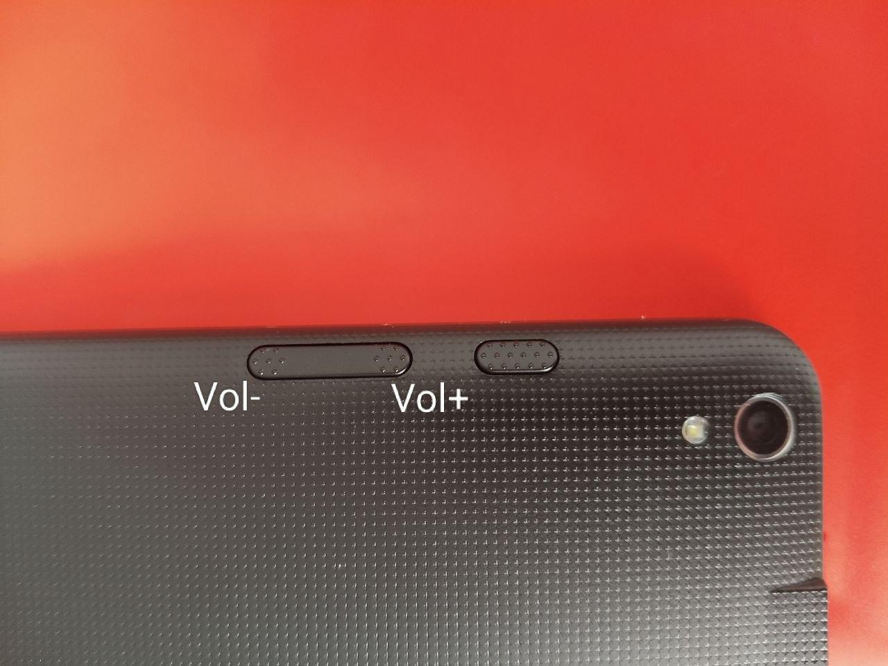

# Medion Lifetab S1024X — Aldi kiosk removal (unkiosk)

Unlock **Medion Lifetab S1024X** tablets that Aldi shipped locked into the kiosk launcher
**AldiTalkFilialApp**: remove the kiosk and install your own launcher, so you get a normal,
usable Android home screen again. (It also *tries* to enable ADB — best-effort, see the note
below; the guaranteed win is the kiosk removal + your launcher.)

Everything is done **offline by editing the system image over BROM** (mtkclient), with
**no adb and no GSI** — the stock ROM boots normally, TEE/keymaster keep working. Fully
reversible (full backup + restore included).

> Keywords: Medion Lifetab S1024X, Aldi kiosk, AldiTalkFilialApp, MT6765, medion_l1016b,
> achilles6, mtkclient, remove kiosk launcher, enable adb, debloat.

---

## 👉 Pick your version (three branches)

| Branch | Best for | What you get |
|---|---|---|
| **[`main`](https://github.com/Youpee/medion-lifetab-s1024x-unlock)** | **Arch / Linux**, no root | Remove the Aldi kiosk + install your own launcher. Native, simplest. |
| **`docker`** (you are here) | **Windows / macOS / any Linux**, no root | Same result, but the offline build runs in a **container**, so it works on any OS. |
| **[`root`](https://github.com/Youpee/medion-lifetab-s1024x-unlock/tree/root)** | want a **fully usable system** | Everything above **+ ROOT (Magisk)** — which fixes what the stripped Medion build leaves broken. |

> **Heads-up:** on the plain no-root build (`main` / `docker`), the stock Medion **`user`**
> image is half-broken — **ADB won't come up, Developer options crash, the notification shade
> and recents don't work.** If you want those actually fixed (working ADB as root, Developer
> options, provisioning, a shade workaround — installed automatically), use the
> **[`root` branch](https://github.com/Youpee/medion-lifetab-s1024x-unlock/tree/root).**

---

## ⚠️ Disclaimer
Unlocking the bootloader and flashing is **at your own risk**: you may void the warranty
and, on mistakes, brick the device (recoverable while your backup + BROM are intact). This
repo contains **no** proprietary Medion/MTK firmware — you work with **your own** backup.
License: MIT.

## Device facts
| | |
|---|---|
| Device | Medion Lifetab S1024X (`medion_l1016b`, board `achilles6`) |
| SoC | MediaTek MT6765 |
| Stock | Android 10, A-only, dynamic partitions (`super`) |
| BROM | unprotected (SBC/SLA/DAA=false) → mtkclient works |
| Kiosk | `/system/priv-app/AldiTalkFilialApp` (the only HOME launcher in stock) |

## Platform support — the build runs in Docker, so it works everywhere
- **Build** (extract `system`, remove the kiosk, inject a launcher, repack `super`) runs inside
  a container, so it works on **Linux, Windows and macOS** — that's `scripts/docker-build.sh`.
  On **Arch/Linux** you can also build natively without Docker (`scripts/build-image.sh`).
- **Get a container engine:** Linux → `scripts/setup.sh` installs **podman** (rootless, no
  daemon/group hassle); **Windows/macOS** → install **Docker Desktop**
  (https://www.docker.com/products/docker-desktop).
- **USB is NOT in Docker.** `backup-stock.sh`, the unlock and `flash.sh` talk to the tablet over
  USB via native **mtkclient** (Python): Linux runs it directly; on **Windows** use **WSL2 +
  usbipd-win** (or native mtkclient + WinUSB/Zadig); **macOS** runs mtkclient natively.

## Requirements
- **~15 GB free disk space** on the PC — the stock `super` backup alone is 4 GB, and the
  build needs working space plus a 4 GB output image. Don't build in `/tmp` (it's RAM/tmpfs).
- A USB **data** cable and an x86_64 Linux PC.

**Easiest:** run **`scripts/setup.sh`** — it installs everything below + mtkclient (best on
Arch, where the single `android-tools` package provides avbtool + lp* + simg2img). On
Debian/Fedora it installs what the repos have and warns about anything missing.

Manual list (if you prefer):
- **mtkclient** — https://github.com/bkerler/mtkclient (in `~/mtkclient`)
- **android-tools**: `avbtool lpmake lpunpack lpdump simg2img img2simg` (all in one package on Arch)
- **e2fsprogs**: `debugfs e2fsck resize2fs dumpe2fs`
- `python3`, `openssl`, `git`, `libusb`
- Unlocked bootloader (via mtkclient `mtk.py da seccfg unlock`, or fastboot — see mtkclient)
- A launcher `.apk` — **KISS** is downloaded automatically by `setup.sh` (F-Droid, FOSS,
  no ads); or bring your own and pass it to `build-image.sh`.

## What is BROM and how to enter it
**BROM** (Boot ROM) is the USB bootloader baked into the SoC itself. It runs *before* any of
the tablet's own firmware, so it's always reachable and effectively unbrickable — this is how
mtkclient reads/writes partitions no matter what state the tablet is in. On this device BROM
is unprotected (SBC/SLA/DAA off), so no auth is needed.

Enter it like this:
1. **Start the mtkclient command FIRST** — it sits waiting for the device.
2. Make sure the tablet is off / not running (a device that isn't booted drops into BROM on
   connect). If it's stuck in a loop, unplug it so it disappears from `lsusb` first.
3. **Press and hold the VOLUME-DOWN button** (the lower-volume side, **not** Power) and, keeping
   it held, plug in USB. mtkclient catches BROM in ~1-2 seconds. (Let go once it connects.)

> **The buttons on the tablet are NOT labelled.** Holding it with the camera at the top-right
> (as in the photo), **VOLUME-DOWN is the button on the LEFT** (`Vol−`):
>
> 

Notes:
- No timing ritual — you do **not** need to "wait N minutes" or hold Power for X seconds.
- If you get `DAA_SIG_VERIFY_FAILED (0x7024)`, the tablet came up in **Preloader** (a later
  stage), not BROM: unplug fully (it must vanish from `lsusb`), then retry holding **Vol−
  BEFORE** inserting USB.

---

## Steps

**Arch quick start (clone + install everything, one line):**
```bash
git clone https://github.com/Youpee/medion-lifetab-s1024x-unlock && cd medion-lifetab-s1024x-unlock && scripts/setup.sh
```

Then run the rest from the repo root:
```bash
# (already inside the cloned folder)

# 0a) one-time: install all dependencies + mtkclient (+ downloads KISS launcher)  [Arch]
scripts/setup.sh

# 0b) REQUIRED: full stock backup (your safety net + donor for the build)
scripts/backup-stock.sh

# 0c) REQUIRED: unlock the bootloader (else vbmeta_disable is ignored and the
#     modified /system won't boot). Tablet in BROM (Vol- + USB), then:
( cd ~/mtkclient && sudo ./venv/bin/python mtk.py da seccfg unlock )
#     -> "Successfully wrote seccfg" = done ("already unlocked" is fine too).
#        This wipes /data on next boot — expected.

# 1) build the flashable image IN A CONTAINER (works on any OS with Docker/Podman)
#    -> produces super_unkiosk.img + vbmeta_disable.img (remove kiosk, add launcher, +best-effort ADB)
scripts/docker-build.sh
#   custom launcher + extra apks: scripts/docker-build.sh launchers/MyLauncher.apk launchers/App1.apk
#   native alternative (Arch/Linux, no Docker): scripts/build-image.sh && scripts/make-vbmeta-disable.sh

# 2) flash (BROM) + wipe /data
scripts/flash.sh super_unkiosk.img vbmeta_disable.img

# 3) when the flash finishes: unplug and power the tablet on — that's it.
#    Your launcher comes up instead of the Aldi kiosk.
#    (the very first boot after a data wipe may take a couple of minutes — normal)

# 4) (optional) once it works, free disk space — removes the ~4 GB build output
#    and .work, but KEEPS your stock backup (your only way back to stock):
scripts/clean.sh          # or: scripts/clean.sh --all  (also removes the container image + KISS)
```

Revert anytime:
```bash
scripts/restore-stock.sh    # restores the factory Aldi ROM
```

## Build with Docker (non-Arch / Windows / macOS)
On **Arch** just use the native flow above — no Docker. On **other systems** you can run the
offline build in a container instead of installing android-tools/e2fsprogs/avbtool yourself:

```bash
# after: git clone ... && cd ...   and after you have a stock backup (see below)
scripts/docker-build.sh            # builds super_unkiosk.img + vbmeta_disable.img in a container
#   custom launcher: put it in launchers/ and: scripts/docker-build.sh launchers/MyLauncher.apk
```
How it works: your repo stays on your disk; the container only provides the build tools and
writes the output back into your folder (owned by you). Costs ~1.2 GB for the toolchain image
(plus the usual build workspace).

**The USB steps are NOT in Docker.** `backup-stock.sh`, the bootloader unlock, and `flash.sh`
talk to the tablet over USB, which Docker can't reliably pass through on Windows/macOS. So:
1. Install **mtkclient** natively (it's just Python) + a USB driver
   (Windows: WinUSB via Zadig; or run everything inside **WSL2** with `usbipd-win`).
2. `backup-stock.sh` → unlock → `docker-build.sh` (or native `build-image.sh`) → `flash.sh`.

> **USB note:** in theory USB should work out of the box, but it's **not guaranteed** —
> MediaTek BROM + USB drivers vary by machine/OS. If mtkclient can't see the tablet, that's a
> driver/OS-level thing beyond this repo — search Google or ask an AI assistant. We can't fix
> USB drivers from here.

## What build-image.sh does
1. Extracts `system/vendor/product` from your `backup_nv/super.bin`.
2. Erases the AVB footer of `system` (verity is turned off via the vbmeta_disable step).
3. Grows the ext4 (+64 MB) to fit extra APKs.
4. `prop.default`: `ro.adb.secure=0`, `ro.debuggable=1`, `persist.sys.usb.config=mtp,adb`
   plus an init override `zz-forceadb.rc` — a **best-effort** ADB enable (often the USB gadget
   still won't come up on this build; see "After boot").
5. Removes `AldiTalkFilialApp.apk` (kiosk is no longer HOME).
6. Installs your launcher (and extra APKs) into `/system/app/<Name>/` labeled `system_file:s0`.
7. Rebuilds `super` (system + stock vendor/product), verifies size / `lpdump`.

## After boot — what you actually get (honest)
- **Your launcher comes up — guaranteed.** No more Aldi kiosk; a normal home screen.
- **ADB is best-effort, and on our tablets it did NOT come up.** The image sets
  `ro.debuggable=1`, `ro.adb.secure=0`, `persist.sys.usb.config=mtp,adb` + a force rc, but on
  this stripped Medion **`user` build** the USB gadget usually doesn't compose (the framework
  keeps `adb_enabled=0`), so `adb devices` may show nothing. Harmless if it doesn't work.
- **Developer options crash.** Tapping *Build number* 7× does turn you into a "developer",
  but **opening** Settings → System → *Developer options* **crashes Settings** on this build,
  so you can't flip USB debugging from the UI either. (Settings is heavily stripped here — no
  search, no USB menu.) The notification shade and *recents* button also don't work.
- **How to add apps without ADB/Play:** either bake them in at build time
  (`scripts/build-image.sh KISS.apk App1.apk App2.apk`), or download an APK in a browser on
  the tablet and install it (allow "unknown sources" when prompted).
- **Want reliable ADB / root / working shade & recents?** Those need root or a permissive
  SELinux policy on this enforcing `user` build — the realistic route is patching `boot` with
  Magisk. For most people, "kiosk gone + a launcher + sideload apps" is already enough.

## Known gotchas
- **Don't panic at the `reset` "error".** When the device powers off after flashing,
  mtkclient almost always prints `DeviceClass - [Errno 2] Entity not found` right before
  `Reset command was sent`. That is **normal** — the tablet just disconnected. If the write
  hit 100%, you're fine: unplug and boot.
- **`user` build + enforcing SELinux**: on the stripped-down Medion build, the notification
  shade / recents and the "Developer options" menu may not work / may crash. This needs
  root (Magisk) or a permissive policy to fully fix — see `docs/FIX_PLAN.md` if included.
  It does not block a normal "working Android + launcher".
- `debugfs` doesn't set SELinux labels itself → the script sets `system_file:s0` (NUL-terminated).
- Re-sealing verity of the modified `/system` needs the OEM key (not available), so we go
  through `vbmeta_disable` (verification off). On an unlocked bootloader this is fine.

## Layout
```
scripts/
  setup.sh               # install all deps + mtkclient (run once)
  backup-stock.sh        # dump a full stock backup (BROM)
  build-image.sh         # build super: remove kiosk + enable adb + add launcher
  make-vbmeta-disable.sh # vbmeta with AVB verification disabled
  flash.sh               # flash super + vbmeta_disable (BROM)
  restore-stock.sh       # restore stock
  clean.sh               # free disk space (removes regenerable build artifacts; keeps backup)
  docker-build.sh        # build the image in a container (non-Arch / Windows / macOS)
Dockerfile               # build toolchain image (for docker-build.sh)
```

## Bonus: use the tablet as a wireless second monitor
Once unlocked, you can turn the tablet into a low-latency wireless **second monitor** for a
Linux PC via Sunshine (host) + Moonlight (tablet). The KDE Plasma Wayland + AMD setup (the
tricky part: forcing a spare DRM connector as a virtual display so Sunshine's `kms` capture
sees it) is documented in **[docs/second-monitor-kde.md](docs/second-monitor-kde.md)**, with
helper scripts in `extras/` (`make-edid.py`, `vmon.sh`).

## Credits
The reverse-engineering, tooling and documentation here were worked out and written
**with the help of Claude (Anthropic)** — from the initial kiosk analysis and the offline
system-image method to the scripts and this guide — and that stays the workflow going forward.
Tools used: mtkclient (bkerler), android-tools, avbtool. Launcher: KISS — fr.neamar.kiss (F-Droid).
