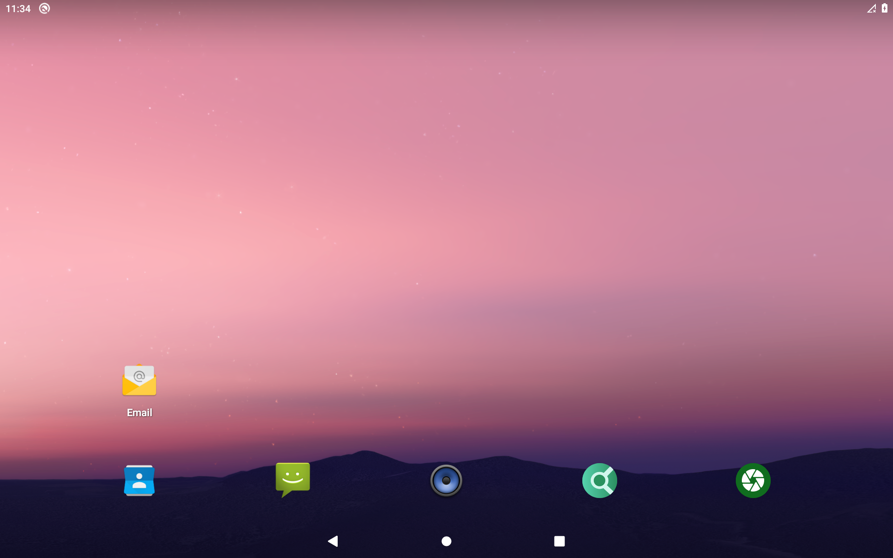
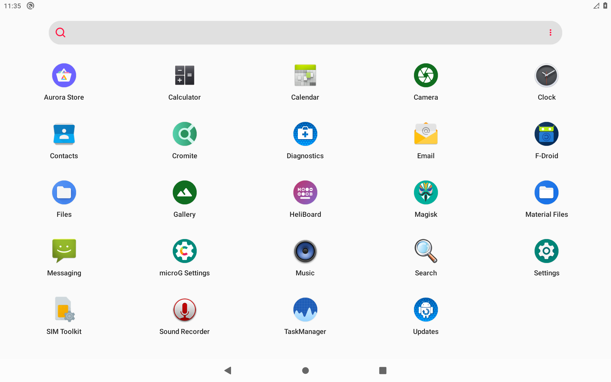
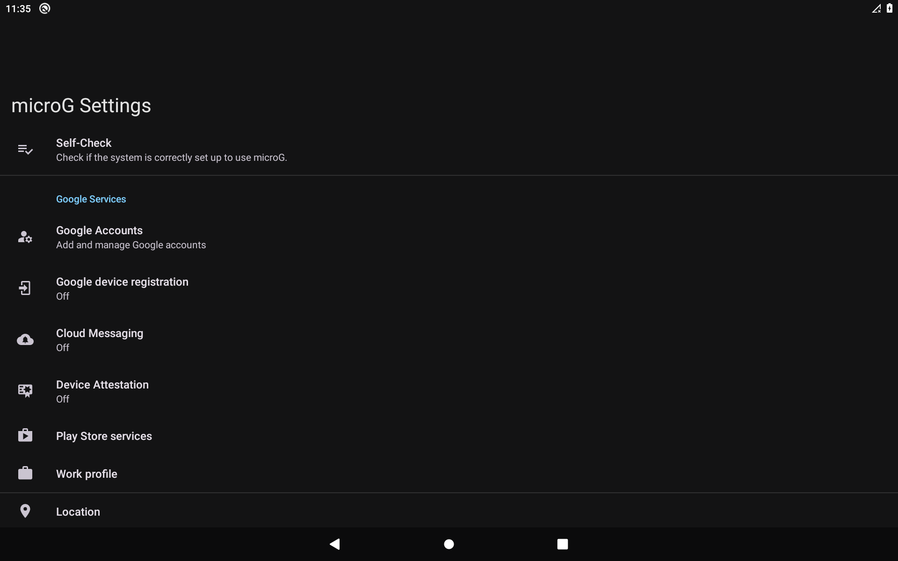
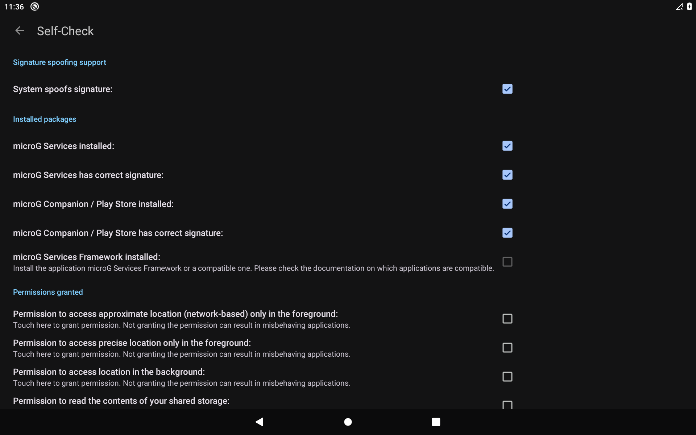
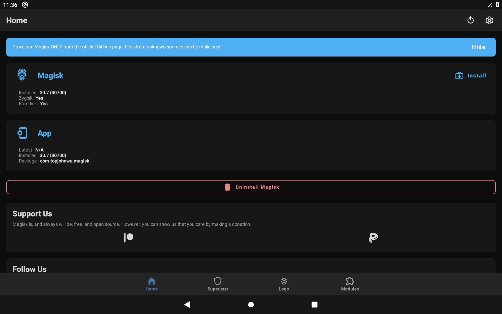

# The open-source app suite — what ships and how it works

This document explains, in depth, the pre-installed application suite on the **root** branch: every
app that gets baked in, *why that specific app was chosen*, where it comes from, and the technical
machinery that makes it all work as **system apps** on a locked-down Medion Lifetab S1024X (MT6765,
Android 10). It is deliberately detailed — it doubles as the design rationale for the feature.

> TL;DR — after a clean flash the tablet boots into a fully usable, **de-Googled** device: a browser,
> two app stores, camera, gallery, files, an offline keyboard, and (root branch) a working **microG**
> with real signature spoofing — with **no Google apps, no trackers, and no manual setup taps.**

### Screenshots

<p float="left">
  
  
  
  
  
</p>

*Left to right: Neo-Launcher home · the full open-source app drawer · microG settings (dark theme) ·
microG Self-Check with **"System spoofs signature"** ticked · Magisk with Zygisk active. All of this
comes up on its own after one flash — no manual taps.*

---

## 1. Design principles

1. **Official sources only.** Every APK is fetched at build time from the project's *own* release
   channel — F-Droid for F-Droid apps, the projects' GitHub Releases for the rest — over HTTPS. This
   repo re-hosts **nothing**; `scripts/fetch-apps.sh` downloads, `scripts/build-image.sh` bakes.
2. **System apps, not `adb install`.** The apps are written into `/system` (`/system/app`,
   `/system/priv-app`) offline, before flashing. Compared to installing them as user apps after boot,
   this means they **survive a factory reset**, become the **default handlers** for their category,
   and need no runtime install step.
3. **No Google, no trackers.** Nothing here talks to Google. The one app that *emulates* Google
   services (microG) is open source and self-hostable, and the shade helper is internet-firewalled.
4. **Pinned + reproducible.** Every app is pinned to an exact version (`scripts/fetch-apps.sh`), so
   everyone builds the same known-good set. `--latest` floats to newest on request.
5. **Optional.** `WITH_APPS=0` skips the whole suite; `WITH_MICROG=0` skips the microG chain; you can
   also delete individual APKs from `apps/` before building.

---

## 2. The apps

| Role | App | Package | Source | Pinned |
|------|-----|---------|--------|--------|
| Browser | **Cromite** | `org.cromite.cromite` | GitHub `uazo/cromite` (arm64) | v148.0.7778.168 |
| App store (FOSS) | **F-Droid** | `org.fdroid.fdroid` | f-droid.org | 1.23.2 (code 1023052) |
| App store (Play, anon) | **Aurora Store** | `com.aurora.store` | F-Droid | 4.8.3 (code 75) |
| Camera | **Fossify Camera** | `org.fossify.camera` | F-Droid | 1.5.0 (code 11) |
| Gallery | **Fossify Gallery** | `org.fossify.gallery` | F-Droid | 1.13.1 (code 28) |
| Files | **Material Files** | `me.zhanghai.android.files` | F-Droid | 1.7.4 (code 39) |
| Keyboard | **HeliBoard** | `helium314.keyboard` | F-Droid | 4.0 (code 4005) |
| Google-app compat (root) | **microG GmsCore** | `com.google.android.gms` | GitHub `microg/GmsCore` | v0.3.15.250932 |
| Play stub (root) | **FakeStore** | `com.android.vending` | GitHub `microg/GmsCore` | v0.3.15.250932 |
| Signature spoofing (root) | **FakeGApps** | `inc.whew.android.fakegapps` | GitHub `whew-inc/FakeGApps` | 6.6 |
| Xposed framework (root) | **LSPosed** (Vector fork) | module `zygisk_vector` | GitHub `JingMatrix/LSPosed` | v2.0 (3021) |

### 2.1 Browser — Cromite (not Brave)

The original feature request suggested **Brave**. We chose **Cromite** instead:

- **Cromite** is the actively-maintained successor to **Bromite** (which was discontinued in 2023). It
  is Chromium with **all Google services stripped**, an **integrated ad-blocker** (AdBlock Plus engine
  with CNAME uncloaking), canvas/WebGL fingerprint mitigations, DoH, and JIT off by default.
- **Brave** is also Chromium-based and privacy-oriented, but it bundles a **crypto wallet, Brave
  Rewards / ad network, and referral partnerships** — extra surface and monetization we don't want on
  a clean de-Googled build.
- Alternatives considered: **Fennec/Mull** (Firefox forks — heavier, and Mull/DivestOS shut down);
  **Vanadium** (GrapheneOS-only). Cromite is the best fit: lean, no Google, no monetization, one APK.

Cromite's arm64 APK is ~190 MB (Chromium is large); its main native library `libchrome.so` is ~215 MB
uncompressed — see §3.2 for why that matters.

### 2.2 App stores — F-Droid + Aurora Store

- **F-Droid** — the reference open-source app repository. This is how the user installs *anything else*
  after first boot, so it's the single most important app to ship.
- **Aurora Store** — an anonymous, open-source client for the Google Play Store. It downloads Play apps
  **without a Google account** and works standalone (it does not require microG). Ships so users can get
  proprietary apps that aren't on F-Droid without ever signing in to Google.

### 2.3 Camera + Gallery — Fossify (not Simple Mobile Tools)

**Fossify Camera** and **Fossify Gallery** are the clean community forks of the former *Simple Mobile
Tools* suite. Simple Mobile Tools was **acquired by ZipoApps** (an ad/analytics company), which is why
the community forked the last clean versions into **Fossify**. We deliberately use Fossify — same clean
UX, no ads, no trackers, actively maintained on F-Droid. (This same "avoid ZipoApps" reasoning comes
back for the notification shade in §8.)

Open Camera was considered for the camera role; Fossify Camera was chosen for a more consistent
Material look alongside Fossify Gallery and a cleaner permission model.

### 2.4 Files — Material Files

`me.zhanghai.android.files` — a clean, Material-styled, root-aware file manager. It replaces the stock
MTK file browser and becomes the default `resource/folder` handler. (It also exposed a real bug in our
baking pipeline — see §3.2.)

### 2.5 Keyboard — HeliBoard

**HeliBoard** (`helium314.keyboard`) is the maintained fork of OpenBoard/AOSP-keyboard. Crucially it
has **no `INTERNET` permission at all** — it is 100 % offline, so it can't leak keystrokes. It replaces
the stock `LatinIME`, and the boot service sets it as the **default input method** (see §5 and §6).
Alternatives: **FlorisBoard** (still beta-ish), **Gboard** (Google, rejected). HeliBoard wins on being
mature *and* offline.

### 2.6 microG (root branch only)

microG is an open-source re-implementation of Google Play Services. It lets apps that depend on "Google
Play Services" run **without Google's proprietary blobs and without a Google account** (though you *can*
sign in to a real Google account once spoofing works — see §7). Three pieces ship:

- **GmsCore** (`com.google.android.gms`) — the core services (location, GCM/FCM, auth). Installed as a
  **privileged** system app (`/system/priv-app`) so it can hold the privileged permissions it needs.
- **FakeStore** (`com.android.vending`) — a tiny stub that satisfies apps which check for "the Play
  Store" package being present.
- **FakeGApps** + **LSPosed** — the signature-spoofing machinery (see §7). Without spoofing microG's
  location still works, but Google **account login** and **FCM push** do not.

microG is **root-only** and is therefore **absent from the `main`/`docker` branches** — it can't work
without root, so shipping it there would be misleading.

---

## 3. How apps become system apps

`scripts/build-image.sh` never touches a running device. It edits the stock `super` image **offline**:
`lpunpack` splits out `system`/`vendor`/`product`, `debugfs` writes files into the ext4 filesystems,
and `lpmake` repacks `super`. AVB/dm-verity is disabled separately via `vbmeta_disable.img`, so the
edited, unsigned partitions boot.

### 3.1 Placement + labels

Each app goes to `/system/app/<Name>/<Name>.apk` (normal) or `/system/priv-app/<Name>/<Name>.apk`
(privileged), every file/dir labeled `u:object_r:system_file:s0` (SELinux) with the right mode. The
`/system` growth is **auto-sized** from the total size of everything being added (+128 MB margin).

### 3.2 Native library extraction (the `UnsatisfiedLinkError` bug)

A read-only `/system` app can't unpack its native libraries at runtime the way `PackageManager` does
for a `/data` install. If the app's `.so` files are **stored uncompressed** inside the APK, the loader
maps them straight from the APK and all is well. If they're **DEFLATED** (`extractNativeLibs=true`),
the loader can't use them from the APK, and the app dies at launch:

```
java.lang.UnsatisfiedLinkError: couldn't find "libhiddenapi.so"          # Material Files
java.lang.UnsatisfiedLinkError: No implementation found for void J.N.VO  # Cromite (libchrome)
```

So at build time we inspect each APK, and for every **deflated** arm64 `.so` we extract it into
`/system/app/<Name>/lib/arm64/`. Apps with **stored** libs (Aurora, F-Droid, both Fossify apps) get no
lib dir — they load from the APK. In this suite the apps that need extraction are **Cromite**
(`libchrome.so` ~215 MB), **microG GmsCore** (~40 MB of libs: cronet, conscrypt, mapbox, opencv…),
**HeliBoard** (`libjni_latinime.so`), and **Material Files** (`libhiddenapi.so` et al.). The
auto-sizer counts these extracted bytes too, which is why `/system` grows ~780 MB on the full build.

### 3.3 Privileged apps + the permission whitelist

This ROM ships `ro.control_privapp_permissions=enforce` (in `/vendor/build.prop`). Under **enforce**, a
privileged app whose `signature|privileged` permissions are **not all whitelisted** makes
`PackageManagerService` throw during the boot scan → **`system_server` crash-loops → the bootloader
drops to recovery.** microG's GmsCore is a priv-app and requests several privileged permissions that a
minimal whitelist misses — we found these the hard way:

```
android.permission.MODIFY_PHONE_STATE
android.permission.MANAGE_USB
android.permission.NETWORK_SCAN
android.permission.START_ACTIVITIES_FROM_BACKGROUND
android.permission.DUMP
```

Rather than chase an exact whitelist (a future microG could add more and re-break boot), the build
flips `/vendor/build.prop` to **`ro.control_privapp_permissions=log`**: privileged permissions are all
**granted** (microG fully works) and violations are only logged, never fatal. We still ship a
`privapp-permissions-microg.xml` whitelist for the common permissions; `log` is the belt-and-suspenders
that guarantees the tablet boots. (This edit only happens when microG is baked; a no-microG build keeps
stock `enforce`.)

### 3.4 Debloat — removing the stock duplicates

Because our apps become the defaults, the stock equivalents would just be confusing duplicates. The
build removes them from `/product` (deleting the `.apk` is enough — `PackageManager` then can't find
the package):

- `/product/app/Camera` — `com.mediatek.camera` → replaced by Fossify Camera
- `/product/app/MtkBrowser` → replaced by Cromite
- `/product/app/LatinIME` — `com.android.inputmethod.latin` → replaced by HeliBoard
- `/product/priv-app/MtkGallery2` → replaced by Fossify Gallery

(WebView, DocumentsUI, providers, dialer, etc. are **kept** — they're system infrastructure.)

---

## 4. Defaults — English + dark theme

Stock ships `ro.product.locale=de-DE`. The build rewrites `/system/build.prop` to
`ro.product.locale=en-US`, so a fresh `/data` comes up in English. The boot service also enables
**system dark mode** once (`cmd uimode night yes`). Both are **one-time** (guarded by a marker in
`/data/adb`), so you can switch language or theme in Settings afterwards and it sticks.

---

## 5. Magisk auto-setup (no "Additional setup" nag)

We patch `boot` with Magisk **offline** (`scripts/build-magisk-boot.sh`) and install the Magisk app via
`pm install` on first boot. That leaves two gaps the Magisk app would normally nag about:

1. **`/data/adb/magisk` is empty.** Magisk's own binaries (`magisk`, `magiskboot`, `magiskinit`,
   `busybox`, `magiskpolicy`, `stub.apk`, `boot_patch.sh`, …) normally get placed there by the app's
   first-run "Additional setup", which also **enables Zygisk**. Without it the app shows *"Requires
   additional setup"* and Zygisk stays off (so LSPosed/microG can't work). We fix this by extracting
   that exact file set from the Magisk APK at build time into `magisk-env.tar`, staging it in
   `/system/etc/medion/`, and having the boot service unpack it into `/data/adb/magisk` on first boot.
   Result: **Zygisk turns on and LSPosed installs itself with zero taps.**

2. **`PREINITDEVICE` is unset.** An offline patch can't auto-detect the device's "preinit" partition
   (where Magisk keeps sepolicy rules before `/data` decrypts). Without it the log warns `preinit dir
   not found` and the app nags *"reflash Magisk … Recovery mode cannot get correct device info"* every
   boot — and pressing its "OK" would do a **Direct Install that overwrites our custom boot** (killing
   the SELinux-permissive fix). This device has a real `persist` partition, so we pass
   `PREINITDEVICE=persist` to `boot_patch.sh`. The warning and the nag both disappear, and Magisk shows
   a clean home screen (Zygisk: Yes, Ramdisk: Yes).

---

## 6. Keyboard activation

Since `LatinIME` is removed, the boot service must make sure HeliBoard is enabled and active or there'd
be **no keyboard at all**. It discovers HeliBoard's IME id dynamically (`ime list -a -s | grep
helium314.keyboard`, robust to class renames), enables it, and sets it as the default input method —
but only if the current IME is missing/stock, so a keyboard you pick later stays.

---

## 7. microG signature spoofing (the deep part)

This is the hardest piece and the one we automated most carefully.

### 7.1 Why spoofing is needed

Apps (and microG's own self-check) verify that "Google Play Services" is signed by **Google**. microG is
signed by microG, so by default those checks fail: you can't sign in to a Google account and FCM push
won't register. **Signature spoofing** makes the framework report *Google's* signature for
`com.google.android.gms`, so the checks pass. On a stock ROM (no patched framework) this needs an Xposed
hook in the system.

### 7.2 The chain

```
Magisk (root) ──> Zygisk (in Magisk) ──> LSPosed (Zygisk module) ──> FakeGApps (Xposed module)
                                                                          │
                                                    hooks the framework's signature checks
                                                                          ▼
                                              microG reports Google's signature → login/push work
```

The build stages **LSPosed** (`apps/microg/LSPosed.zip`, the JingMatrix "Vector" fork) and installs it
as a Magisk module on first boot; **FakeGApps** is baked as a normal system app. Both are pinned.

### 7.3 The LSPosed config database — what we edit and why

LSPosed stores which modules are enabled and their **scope** (which processes a module is injected into)
in a SQLite database at:

```
/data/adb/lspd/config/modules_config.db
```

Schema (Vector fork, v2.0):

```sql
modules(mid INTEGER PK, module_pkg_name TEXT UNIQUE, apk_path TEXT, enabled BOOLEAN, auto_include BOOLEAN)
scope  (mid INTEGER, app_pkg_name TEXT, user_id INTEGER, PRIMARY KEY(mid, app_pkg_name, user_id))
configs(module_pkg_name, user_id, group, key, data)   -- per-module settings
```

Normally you'd open the LSPosed manager, toggle **FakeGApps** on, and tick its scope. But on this
device the manager is **parasitic** (no launcher icon — you open it by tapping LSPosed's persistent
notification), and **the notification shade is broken** (see §8), so the UI is awkward to reach. So we
enable the module **from the database** instead: a row in `modules` with `enabled=1`, plus `scope`
rows for the processes FakeGApps must hook.

### 7.4 The key discovery: `system`, not `android`

FakeGApps must hook the **system framework** (`system_server`) — that's where signature checks live. In
**upstream** LSPosed the system-framework pseudo-app is the package **`android`**. So we first scoped
FakeGApps to `android` + `com.google.android.gms`, rebooted… and microG's *"System spoofs signature"*
stayed **unchecked**. The verbose LSPosed log told us why:

```
I/Vector : Loading Vector/Xposed for system (UID: 1000)          <-- system_server, called "system"
I/VectorNative : Injected Vector framework into system_server.
...
I/LSPosed-Bridge : Loading legacy module inc.whew.android.fakegapps ...   (only into com.google.android.gms)
```

The **JingMatrix "Vector" fork identifies `system_server` as the package `system`, not `android`.** With
`android` in scope, FakeGApps only loaded into the GMS processes — never into `system_server` — so the
framework never spoofed. Adding **`system`** to the scope made FakeGApps load into `system_server`
(`1000: … Loading legacy module inc.whew.android.fakegapps`), and microG's self-check immediately
flipped to:

```
Signature spoofing support
  System spoofs signature:                    ✓
  microG Services has correct signature:      ✓
  microG Companion / Play Store correct sig:  ✓
```

So the module is seeded with scope **`system` + `android` + `com.google.android.gms`** (`system` is the
one that matters here; the others are kept for parity/robustness).

### 7.5 Automating it — the seed DB + **two** auto-reboots

We can't run SQL on the device (no `sqlite3` binary there), and we can't rely on the broken shade to
reach the manager. So `build-image.sh` **generates the finished `modules_config.db` at build time** with
the host's `sqlite3` (from the schema above, FakeGApps enabled and scoped), and stages it as
`/system/etc/medion/lspd-seed.db`. The boot service then walks a small state machine.

**Why two reboots are unavoidable.** There's a hard ordering dependency baked into how Magisk/Zygisk/
LSPosed load, and it can't be collapsed into a single boot:

- **Zygisk only goes live after a reboot.** On the *very first* boot the service turns Zygisk on in
  Magisk's settings DB (`REPLACE INTO settings (key,value) VALUES('zygisk',1)`), but zygote has already
  started *without* the Zygisk hook for this boot. Zygisk only injects into zygote when zygote starts
  *fresh with the setting already on* — i.e. next boot.
- **LSPosed can't create its config DB until Zygisk is live.** LSPosed is a Zygisk module; with Zygisk
  inactive it never runs, so `/data/adb/lspd/config/modules_config.db` doesn't exist yet — which means
  there's nothing for the seed to overwrite.
- **So the seed has to wait for a boot where Zygisk is live and LSPosed has produced its DB.** That's a
  *different* boot from the one where we first enabled Zygisk.

This is a chicken-and-egg: the reboot that *activates* Zygisk is a precondition for the DB that the seed
reboot needs. Early builds had only the seed reboot and **deadlocked on a clean flash** — Zygisk got
enabled but nothing ever rebooted to activate it, so LSPosed never ran, the seed condition never became
true, and the user had to reboot by hand (silent, easy-to-miss failure). The fix is to make *both*
reboots automatic. On a fresh install the service therefore fires them in order:

**Reboot 1 — activate Zygisk.** After enabling Zygisk + installing the LSPosed module, the service checks
whether Zygisk is actually injected into zygote (`grep zygisk /proc/<zygote64-pid>/maps`). If it isn't, it
`touch`es `/data/adb/medion-zygisk-activated` and triggers a controlled reboot (`setprop sys.powerctl
reboot`). The marker guarantees this happens once.

**Reboot 2 — load the spoofing seed.** On the next boot Zygisk is live, LSPosed runs and creates its own
`modules_config.db`. Now the service:

1. copies the seed over `modules_config.db` (and removes the stale `-wal`/`-shm`),
2. fixes owner/mode/SELinux label,
3. drops `/data/adb/medion-lspd-seeded`, and
4. triggers the second controlled reboot, guarded by that marker.

After reboot 2, LSPosed loads FakeGApps into `system_server` and spoofing is live — **no manual LSPosed
taps, ever.** Both markers live in `/data/adb` (wiped on reflash, so the whole dance re-runs cleanly on a
fresh install and **never** on later normal boots — there is no third reboot and no loop). End users see:
first boot → lands on Neo → reboots itself → reboots itself again → done. `scripts/verify.sh` confirms
*"signature spoofing active (system_server)"*. (Without host `sqlite3` the build skips the seed and this
becomes a documented manual LSPosed step instead.)

---

## 8. The notification shade

The stock SystemUI shade on this build is broken at the SystemUI level (the panel window never expands;
SystemUI is platform-signed, so we can't patch it). The only apps that draw their *own* shade panel via
Accessibility are **Treydev's** — *Material Notification Shade*, *Power Shade*, *One Shade* — which are
all one developer, now under **ZipoApps** (the same ad company we avoided for the camera/gallery). There
is **no open-source shade** (re-implementing the whole panel is too big a project).

Rather than ship a proprietary app, the build **auto-configures whichever one you install**: on every
boot the service detects a `com.treydev.*` package and (a) blocks **all** its internet with the root
`iptables` firewall — the shade panel itself has no ads, and ads/trackers only load over the network, so
this makes it effectively ad- and tracker-free — and (b) pre-grants overlay + notification-listener +
accessibility so it "just works". You install the official APK once and reboot; nothing else.

(`GravityBox` via LSPosed and `Iconify` were both evaluated — GravityBox only *customizes* a shade that
already opens, and Iconify requires Android 12+. Neither can make a non-opening Android-10 shade open,
which is why an independent-panel app remains the answer.)

---

## 9. Version pinning

Every app is pinned to an exact build in `scripts/fetch-apps.sh` (F-Droid apps by `versionCode`, GitHub
apps by release tag + asset name), so every build produces the same validated set and a future upstream
change can't silently break the image. `scripts/fetch-apps.sh --latest` ignores the pins and fetches the
newest of each; `scripts/fetch-apps.sh --check` just validates that every pinned URL still resolves. The
exact resolved versions are written to `apps/VERSIONS.txt` at fetch time.

---

## 10. What you get, end to end

A clean flash + a couple of boots yields, with **zero manual app/LSPosed/Magisk taps**:

- kiosk gone; **KISS** launcher; **English + dark** by default;
- **Cromite, F-Droid, Aurora, Fossify Camera & Gallery, Material Files, HeliBoard** as system defaults;
- stock camera/browser/gallery/keyboard removed;
- **root** (Magisk, clean — no setup nag), **adb over USB as root**, Developer options;
- **microG** with **working signature spoofing** → Google account login + FCM push;
- a one-install, auto-firewalled notification shade.

Everything is offline-built from your own stock backup and fully reversible (restore stock from backup).
